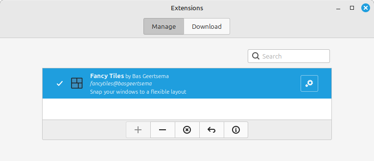
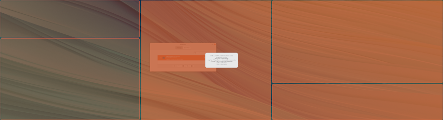
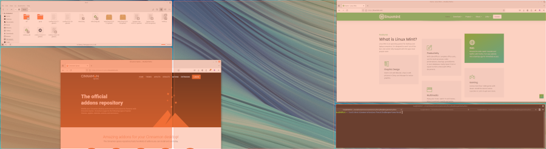

# Fancy Tiles (Fork)

> This is a fork of [BasGeertsema/fancytiles](https://github.com/BasGeertsema/fancytiles) with performance optimizations and additional features.

Fancy Tiles is a [Cinnamon](https://github.com/linuxmint/Cinnamon) Extension that snaps your windows to regions in a very flexible layout. This layout does not have to be a typical grid where horizontal and vertical lines span the screen and columns and rows do not have to be evenly distributed. This is inspired by the way [Fancy Zones](https://learn.microsoft.com/en-us/windows/powertoys/fancyzones) work in Windows.

## Fork Features

### Performance optimizations for high-resolution displays
- **Smart repaint** - Only repaints when the highlighted zone actually changes, not on every pixel of mouse movement
- **Fast rendering during snapping** - Uses plain rect fills instead of rounded rects with borders during window snapping (rounded rects with borders are still used in the grid editor)
- **Editor-only info overlay** - Zone numbers, dimensions, and gap text are only shown in the grid editor, not during snapping

### Additional features
- **Fullscreen edge snap** - Drag a window to any screen edge and all zones highlight for a fullscreen snap
- **Proximity-based multi-zone spanning** - Multi-zone spanning uses a proximity threshold near zone edges rather than locking in on hover, giving more control over single vs multi-zone snapping
- **Zone info in editor** - Grid editor displays zone numbers, pixel dimensions, and gap sizes for each zone with shadow text for readability

## Install

Download the code in this repository and place it in the directory `~/.local/share/cinnamon/extensions/fancytiles@basgeertsema` . Or use the one-liner below to download and install directly.

```bash
mkdir -p ~/.local/share/cinnamon/extensions/fancytiles@basgeertsema && (curl -s -L https://github.com/lcestou/fancytiles/archive/refs/heads/main.tar.gz | tar xvz -C ~/.local/share/cinnamon/extensions/fancytiles@basgeertsema --strip-components=1)
```

Open Cinnamon Extensions, click on the Fancy Tiles extension and click the '+' button to enable Fancy Tiles.




## Quick start

After enabling the extension, press `<SUPER>+G` to open the layout editor. It will start with a 2x2 grid layout. Click and drag the dividers (the lines between regions) to resize the regions. If you want to split a region, press `<SHIFT>` or `<CTRL>` while hovering over the region to split the region horizontally or vertically. Use the `right mouse button` to remove dividers. Use `<Page Up>` and `<Page Down>` to increase or decrease the spacing between the regions.

After you have crafted your desired layout, exit the editor using `<SUPER>+G` or `<ESC>`.



Now, start dragging a window and simultaneously hold the `<CTRL>` key. The layout will become visible. Hover your mouse over the region you want the window to snap to and release the mouse button. The window will now be snapped into place.

### Multi-zone spanning

Windows can span across multiple adjacent regions. When dragging a window near the edge between two adjacent regions, both regions will be highlighted, and the window will snap to cover the combined area of both regions.

### Fullscreen snap

Drag a window to any screen edge (within 30px of the perimeter) and all zones will highlight. Release to snap the window to the full screen area.



## Loading and saving presets

There are 8 slots to hold layout presets. Presets 4-8 are read only _system presets_ and 1-4 are your _user presets_. When the layout editor is opened, press `<SPACE>` to view the presets, and click the preset you want to load. Similarly, press the `<ALT>` key to open the save preset dialog and select one of the four user slots that you want to save the current layout to.

Tip: you can quickly load presets by opening the layout editor and immediately press the slot number of your desired preset (1-8).
